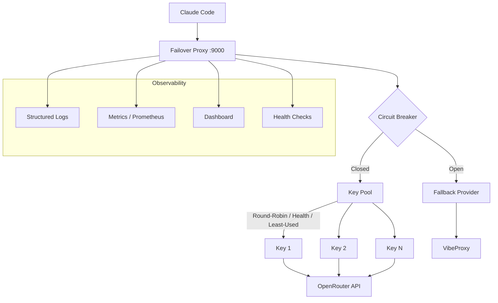

# failover-proxy v4.0

Enterprise-grade AI Gateway for Claude Code with multi-provider failover, circuit breakers, key rotation, and rich observability.

## Features

- **Multi-provider failover** — OpenRouter (primary) + VibeProxy (optional) with automatic failover
- **Circuit breakers** — Per-provider closed/open/half-open state machine with automatic recovery
- **Key pool** — Round-robin, least-used, or weighted-health key selection with exponential backoff cooldown
- **Model mapping** — Centralized model registry with Claude alias remapping and validation
- **Streaming reliability** — Stream error handling, pipe supervision, success tracked on completion
- **Observability** — Structured JSON logs, Prometheus metrics, rich HTML dashboard
- **Security** — Header sanitization, body size limits, XSS-safe dashboard
- **Graceful shutdown** — In-flight request draining on SIGTERM/SIGINT
- **Zero runtime dependencies** — Only Node.js built-ins at runtime

## Quick Install

### macOS & Linux

```bash
git clone https://github.com/Deekshith06/failover-proxy.git ~/failover-proxy
cd ~/failover-proxy
npm install && npm run build
OPENROUTER_KEYS="YOUR_KEY_1,YOUR_KEY_2" ./install.sh
source ~/.zshrc
claude
```

### Windows (WSL or Git Bash)

```bash
git clone https://github.com/Deekshith06/failover-proxy.git ~/failover-proxy
cd ~/failover-proxy
npm install && npm run build
OPENROUTER_KEYS="YOUR_KEY_1,YOUR_KEY_2" ./install.sh
source ~/.bashrc
claude
```

Replace keys with real OpenRouter API keys from [openrouter.ai/keys](https://openrouter.ai/keys).

## Endpoints

| Endpoint | Method | Description |
| --- | --- | --- |
| `/health` | GET | Lightweight liveness check (JSON) |
| `/health/deep` | GET | Readiness check with provider connectivity |
| `/dashboard` | GET | Rich HTML dashboard (auto-refreshes) |
| `/metrics` | GET | Prometheus-compatible metrics (or JSON) |
| `/providers` | GET | Provider status and circuit breaker states |
| `/models` or `/v1/models` | GET | Filtered model list |
| `/keys` or `/statistics` | GET | Key health, usage, and credit info |
| `/v1/*` | POST | Proxy to upstream providers |

## Architecture



## Claude Code Settings

## Configuration

After installation, `~/.claude/settings.json` is configured with:

```json
{
  "env": {
    "ANTHROPIC_BASE_URL": "http://localhost:9000",
    "ANTHROPIC_AUTH_TOKEN": "dummy-not-used",
    "ANTHROPIC_API_KEY": "",
    "ANTHROPIC_MODEL": "nvidia/nemotron-3-super-120b-a12b:free",
    "ANTHROPIC_DEFAULT_OPUS_MODEL": "moonshotai/kimi-k2.6:free",
    "ANTHROPIC_DEFAULT_SONNET_MODEL": "minimax/m2-5:free",
    "ANTHROPIC_DEFAULT_HAIKU_MODEL": "deepseek/deepseek-v4-flash:free",
    "CLAUDE_CODE_SUBAGENT_MODEL": "openai/gpt-oss-120b:free",
    "CLAUDE_CODE_ENABLE_GATEWAY_MODEL_DISCOVERY": "1",
    "DISABLE_TELEMETRY": "1"
  },
  "hasCompletedOnboarding": true
}
```
```json
{
  "env": {
    "ANTHROPIC_BASE_URL": "http://localhost:9000",
    "ANTHROPIC_AUTH_TOKEN": "dummy-not-used",
    "ANTHROPIC_API_KEY": "",
    "ANTHROPIC_MODEL": "nvidia/nemotron-3-super-120b-a12b:free",
    "ANTHROPIC_DEFAULT_OPUS_MODEL": "moonshotai/kimi-k2.6:free",
    "ANTHROPIC_DEFAULT_SONNET_MODEL": "minimax/m2-5:free",
    "ANTHROPIC_DEFAULT_HAIKU_MODEL": "deepseek/deepseek-v4-flash:free",
    "CLAUDE_CODE_SUBAGENT_MODEL": "openai/gpt-oss-120b:free",
    "CLAUDE_CODE_ENABLE_GATEWAY_MODEL_DISCOVERY": "1",
    "DISABLE_TELEMETRY": "1"
  },
  "hasCompletedOnboarding": true
}
```

## Configuration

| Variable | Default | Description |
| --- | --- | --- |
| `OPENROUTER_KEYS` | required | Comma-separated OpenRouter API keys |
| `VIBEPROXY_BASE_URL` | — | VibeProxy base URL (enables VibeProxy provider) |
| `VIBEPROXY_API_KEY` | — | VibeProxy API key |
| `PORT` | `9000` | Local proxy port |
| `LOG_LEVEL` | `info` | Log level: debug, info, warn, error, fatal |
| `REQUEST_TIMEOUT_MS` | `30000` | Upstream request timeout |
| `COOLDOWN_MS` | `30000` | Base key cooldown after failure |
| `MAX_COOLDOWN_MS` | `300000` | Maximum cooldown (5 min) with exponential backoff |
| `MAX_BODY_BYTES` | `10485760` | Max request body size (10 MB) |
| `MAX_RETRIES` | `10` | Maximum retry attempts across all keys |
| `BODY_TIMEOUT_MS` | `30000` | Request body buffering timeout |
| `MODEL_FILTER_REGEX` | `claude` | Regex to hide models from `/v1/models` |
| `SHUTDOWN_GRACE_PERIOD_MS` | `10000` | Graceful shutdown drain period |

## Development

```bash
# Install dependencies
npm install

# Run in development mode (tsx, no build needed)
OPENROUTER_KEYS="key1,key2" npm run dev

# Build TypeScript
npm run build

# Run tests
npm test

# Type check
npm run lint
```

## Test

```bash
# Health check
curl http://localhost:9000/health | jq

# Metrics (JSON)
curl http://localhost:9000/metrics | jq

# Metrics (Prometheus)
curl -H "Accept: text/plain" http://localhost:9000/metrics

# Dashboard
open http://localhost:9000/dashboard

# Test request
curl -X POST http://localhost:9000/v1/messages \
  -H "Content-Type: application/json" \
  -d '{"model":"openai/gpt-oss-120b:free","max_tokens":50,"messages":[{"role":"user","content":"hi"}]}'
```

## Uninstall

```bash
cd ~/failover-proxy
./uninstall.sh
```

Restore Claude settings from `~/.claude/backups/` if needed.